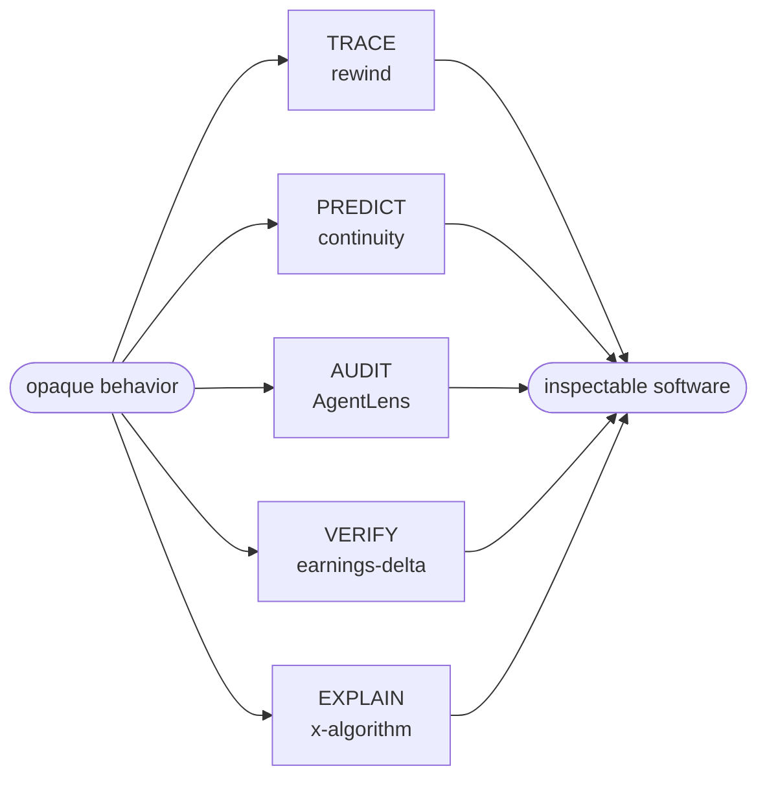

<h1 align="center">MIHIRSINH CHAVDA</h1>

<p align="center">
  <samp>software engineer · inspectable AI systems · Toronto</samp>
</p>

<p align="center">
  <a href="https://mihirsinhchavda.com"><strong>portfolio</strong></a>
  &nbsp;·&nbsp;
  <a href="https://www.linkedin.com/in/mihirsinh-chavda-7115b922b/">linkedin</a>
  &nbsp;·&nbsp;
  <a href="mailto:mihhhir08@gmail.com">email</a>
</p>

I build software for the moment a black box has to become a glass box — replaying an AI decision, predicting a breaking change, tracing a financial claim back to its evidence.



## Five proofs

| | | |
|:--|:--|:--|
| **TRACE** | [**rewind**](https://github.com/mihhhir08/rewind) — record an LLM run once, replay it offline, fork any step to test a counterfactual | `record → replay → fork → compare` |
| **PREDICT** | [**continuity**](https://github.com/mihhhir08/continuity) — predict the break before release, propose the repair, leave an attestation behind | `predict → repair → verify → attest` |
| **AUDIT** | [**AgentLens**](https://github.com/mihhhir08/AgentLens) — local audit reports for AI coding sessions: commands, diffs, failures, risk flags | `capture → diff → flag → report` |
| **VERIFY** | [**earnings-delta**](https://github.com/mihhhir08/earnings-delta) — detect what materially changed without separating the conclusion from its evidence | `extract → calculate → qualify → cite` |
| **EXPLAIN** | [**x-algorithm-explained**](https://github.com/mihhhir08/x-algorithm-explained) — turn a large open-source ranking pipeline into something you can actually explore | `source → model → simulate → understand` |

## Replay a run, live

> [!TIP]
> This is not a screenshot. Pick a step, submit the pre-filled issue, and a workflow replays this run from that fork point and rewrites the block below. The commit history is the audit log.
>
> The trace is a recorded sample in [`replay/trace.json`](replay/trace.json), replayed offline — no model call, no network. Determinism is the point: the same fork always returns the same timeline. It is [rewind](https://github.com/mihhhir08/rewind) in miniature.

<!-- replay:start -->

```text
run r-8f2a1c · recorded 2026-08-14 · forked at step 2

? Which deploy broke checkout?

   0  plan     list deploys in window
   1  tool     deploys.list(14:00)      → 4 candidates

  ── fork at 2 ────────────────────────────

  recorded
   2  tool     diff(d3)                 → session.ts +18 −4
   3  reason   TTL 30m → 45s            → cart expires mid-pay
   4  answer   d3 broke checkout        → confidence 0.91

  forked
   2  tool     diff(d3, scope=svc)      → no changes
   3  reason   shared edit unseen       → cause hidden
   4  answer   d3 looks clean           → confidence 0.55

  diverges: diff scoped to the service, not the shared package
  outcome:  d3 broke checkout  →  d3 looks clean
```

Fork this run at step: [0](https://github.com/mihhhir08/mihhhir08/issues/new?title=replay:%20fork%200) · [1](https://github.com/mihhhir08/mihhhir08/issues/new?title=replay:%20fork%201) · [2](https://github.com/mihhhir08/mihhhir08/issues/new?title=replay:%20fork%202) · [3](https://github.com/mihhhir08/mihhhir08/issues/new?title=replay:%20fork%203) · [4](https://github.com/mihhhir08/mihhhir08/issues/new?title=replay:%20fork%204) — opens a pre-filled issue. The workflow replays it and rewrites this section.

<!-- replay:end -->

## Operating range

| Systems | Product | Data |
|:--|:--|:--|
| Rust · Python · Node.js | TypeScript · React · Next.js | PostgreSQL · Supabase · SQLite |
| replay · verification · automation | interaction · full-stack delivery | evidence · analytics · access control |

> [!IMPORTANT]
> I care less about making software *look* intelligent than about making its decisions inspectable, testable, and useful.

<p align="center">
  <sub>Open to software and AI engineering roles · open-source collaborations welcome</sub>
</p>
